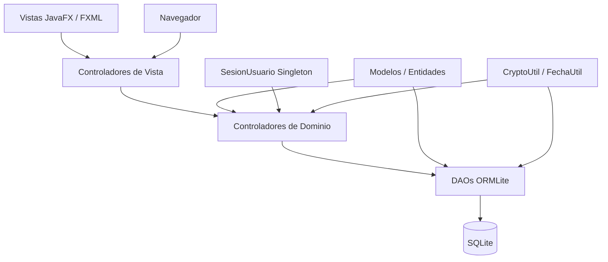
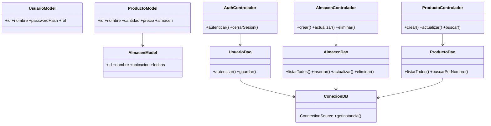

# 📦 Sistema de Inventario v2.0

[](https://openjdk.org/projects/jdk/17/)
[](https://openjfx.io/)
[](https://ormlite.com/)
[](https://junit.org/junit5/)
[](https://sqlite.org/)
[](LICENSE)

Sistema de gestión de inventario reimplementado desde cero con arquitectura en capas, JavaFX, ORMLite y patrón DAO. Esta versión 2.0 reemplaza completamente la v1.0 basada en Swing/JDBC puro.

---

## 📋 Tabla de Contenidos

- [Características](#-características)
- [Arquitectura](#-arquitectura)
- [Estructura de paquetes](#-estructura-de-paquetes)
- [Requisitos](#-requisitos)
- [Instalación y ejecución](#-instalación-y-ejecución)
- [Usuarios predefinidos](#-usuarios-predefinidos)
- [Ejecutar pruebas](#-ejecutar-pruebas)
- [Generar documentación JavaDoc](#-generar-documentación-javadoc)
- [Mejoras respecto a la v1.0](#-mejoras-respecto-a-la-v10)
- [Diagrama de arquitectura](#-diagrama-de-arquitectura)

---

## ✨ Características

- **Autenticación** con 3 roles: ADMIN, PRODUCTOS, ALMACENES
- **Gestión de Almacenes**: crear, listar, editar, eliminar con timestamps automáticos
- **Gestión de Productos**: crear, listar, editar, eliminar con relación a almacén
- **Búsqueda en tiempo real** de productos por nombre
- **Cierre de sesión** con limpieza completa de caché de vistas
- **Trazabilidad**: cada operación registra el usuario real de la sesión activa
- **Navegación con caché**: las vistas FXML se cargan una sola vez y se reutilizan

---

## 🏗️ Arquitectura

La v2.0 implementa una arquitectura **MVC en capas** con separación estricta de responsabilidades:

```
┌─────────────────────────────────────────────────────────┐
│  CAPA DE PRESENTACIÓN  (mx.unison.inventario.vistas)    │
│  LoginControlador · InicioControlador                   │
│  AlmacenesControlador · ProductosControlador            │
│             ↕ delega lógica de negocio                  │
├─────────────────────────────────────────────────────────┤
│  CONTROLADORES DE DOMINIO (mx.unison.inventario.        │
│                             controladores)              │
│  AuthControlador · AlmacenControlador                   │
│  ProductoControlador                                    │
│             ↕ accede a datos vía DAOs                   │
├─────────────────────────────────────────────────────────┤
│  CAPA DE DATOS  (mx.unison.inventario.datos)            │
│  UsuarioDao · AlmacenDao · ProductoDao                  │
│  ConexionDB (singleton ORMLite)                         │
│             ↕ JDBC / sqlite-jdbc                        │
├─────────────────────────────────────────────────────────┤
│  BASE DE DATOS  SQLite — db/inventario_v2.db            │
│  Tablas: usuarios · almacenes · productos               │
│             ↕ POJOs con anotaciones ORMLite             │
├─────────────────────────────────────────────────────────┤
│  MODELOS  (mx.unison.inventario.modelos)                │
│  UsuarioModel · AlmacenModel · ProductoModel            │
│  SesionUsuario (Singleton)                              │
└─────────────────────────────────────────────────────────┘
```

### Navegación entre vistas

```
 LOGIN ──(autenticación OK)──► INICIO
                                 │
                    ┌────────────┴────────────┐
                    ▼                         ▼
               PRODUCTOS                 ALMACENES
                    │                         │
                    └────────(Regresar)───────┘
                                 │
                          (Cerrar sesión)
                                 │
                              LOGIN
```

---

## 📁 Estructura de paquetes

```
src/
└── main/
    └── java/mx/unison/inventario/
        ├── modelos/           # Entidades ORMLite + SesionUsuario
        │   ├── UsuarioModel.java
        │   ├── AlmacenModel.java
        │   ├── ProductoModel.java
        │   └── SesionUsuario.java
        ├── datos/             # DAOs + ConexionDB
        │   ├── ConexionDB.java
        │   ├── UsuarioDao.java
        │   ├── AlmacenDao.java
        │   └── ProductoDao.java
        ├── controladores/     # Lógica de negocio
        │   ├── AuthControlador.java
        │   ├── AlmacenControlador.java
        │   └── ProductoControlador.java
        ├── vistas/            # Controladores JavaFX
        │   ├── LoginControlador.java
        │   ├── InicioControlador.java
        │   ├── AlmacenesControlador.java
        │   └── ProductosControlador.java
        ├── navegacion/        # Sistema de navegación
        │   ├── Navegador.java
        │   └── NecesitaNavegador.java
        ├── utileria/          # Utilidades
        │   ├── CryptoUtil.java
        │   └── FechaUtil.java
        └── MainApp.java       # Punto de entrada JavaFX
└── resources/mx/unison/inventario/vistas/
    ├── login.fxml
    ├── inicio.fxml
    ├── almacenes.fxml
    └── productos.fxml
```

---

## ⚙️ Requisitos

| Dependencia | Versión mínima |
|---|---|
| Java JDK | 17 |
| Maven | 3.8+ |
| JavaFX | 21.0.2 (gestionado por Maven) |
| ORMLite | 6.1 (gestionado por Maven) |
| SQLite JDBC | 3.45.1.0 (gestionado por Maven) |

---

## 🚀 Instalación y ejecución

### 1. Clonar el repositorio

```bash
git clone https://github.com/tu-usuario/inventario-v2.git
cd inventario-v2
```

### 2. Compilar y ejecutar con Maven

```bash
mvn clean javafx:run
```

### 3. Generar fat-JAR ejecutable

```bash
mvn clean package -DskipTests
java -jar target/inventario-v2-2.0.0-jar-with-dependencies.jar
```

La base de datos SQLite se crea automáticamente en `db/inventario_v2.db` al primer arranque.

---

## 👤 Usuarios predefinidos

| Usuario | Contraseña | Rol |
|---|---|---|
| `ADMIN` | `admin23` | Acceso total |
| `PRODUCTOS` | `productos19` | Gestión de productos |
| `ALMACENES` | `almacenes11` | Gestión de almacenes |

> ⚠️ Las contraseñas se almacenan como hashes MD5. Para producción real, migrar a BCrypt o Argon2.

---

## 🧪 Ejecutar pruebas

```bash
# Ejecutar todos los tests
mvn test

# Ejecutar tests + reporte de cobertura JaCoCo
mvn verify

# Ver reporte de cobertura en el navegador
open target/site/jacoco/index.html
```

### Suites de prueba incluidas (~236 tests)

| Suite | Tests | Cobertura |
|---|---|---|
| `CryptoUtilTest` | 20 | MD5, null, formato, determinismo |
| `UsuarioDaoTest` | 25 | Autenticación, inyección SQL, Optional |
| `AlmacenDaoTest` | 30 | CRUD, timestamps, caracteres especiales |
| `ProductoDaoTest` | 35 | CRUD, JOIN, búsqueda parcial, bordes |
| `AuthControladorTest` | 20 | Autenticación con mocks Mockito |
| `AlmacenControladorTest` | 25 | Validaciones, usuario real de sesión |
| `ProductoControladorTest` | 30 | Validaciones, bordes numéricos |
| `SesionUsuarioTest` | 15 | Singleton, inicio/cierre de sesión |
| `FechaUtilTest` | 12 | Formato ISO, null |
| `IntegracionTest` | 24 | Flujos CRUD + concurrencia |

---

## 📖 Generar documentación JavaDoc

```bash
# Generar JavaDoc HTML
mvn javadoc:javadoc

# Abrir en el navegador
open target/site/apidocs/index.html
```

---

## 🆙 Mejoras respecto a la v1.0

### Arquitectura

| Aspecto | v1.0 | v2.0 |
|---|---|---|
| Organización | 1 paquete, 11 clases sin capas | 6 paquetes con responsabilidades claras |
| ORM | JDBC puro + SQL literal | ORMLite con anotaciones en entidades |
| Patrón de datos | Métodos en `Database.java` | DAOs tipados con `Optional<T>` |
| Interfaz | Java Swing (`JPanel`, `JTable`) | JavaFX con FXML y `TableView<T>` |
| Controladores | No existían (lógica en JPanel) | Controladores de dominio inyectables |
| Navegación | `CardLayout` manual | `Navegador` con caché de vistas |

### Seguridad

| Vulnerabilidad | v1.0 | v2.0 |
|---|---|---|
| Usuario de operación | ❌ Hardcoded `"ADMIN"` siempre | ✅ `SesionUsuario.getNombreUsuario()` |
| Encapsulamiento | ❌ Campos `public` directos | ✅ `private` + getters/setters |
| Cierre de sesión | ❌ No implementado | ✅ `cerrarSesion()` + limpieza de caché |
| Verificación `null` | ❌ NPE sin control en `md5(null)` | ✅ `IllegalArgumentException` explícita |
| Trazabilidad de cambios | ❌ Auditoría imposible | ✅ Usuario real en cada operación |

### Pruebas

| Aspecto | v1.0 | v2.0 |
|---|---|---|
| Total de tests | 10 | ~236 (+2260%) |
| Inyección SQL | ❌ | ✅ |
| Concurrencia | ❌ | ✅ |
| Mocks (Mockito) | ❌ | ✅ |
| Cobertura JaCoCo | ❌ Sin configurar | ✅ ≥ 70% requerido |
| Bordes numéricos | ❌ | ✅ |

---

## 📊 Diagrama de arquitectura (Mermaid)





---

## 📄 Licencia

MIT License — ver [LICENSE](LICENSE) para detalles.

---

*Sistema de Inventario v2.0 — Universidad de Sonora — Verificación y Validación de Software — 2026*
